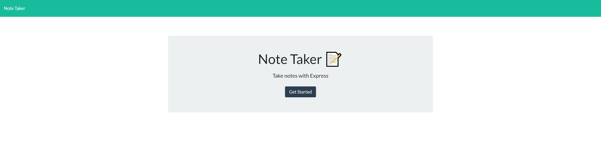
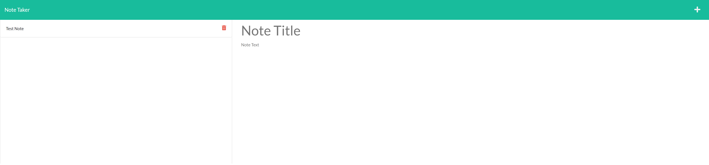

# Express JS: Note Taker

## Link

https://dry-river-37645.herokuapp.com/

## Description
The goal of this project is to create the backend for a note taking app using express.js.  Front-end developement for the application is already made, but parts need to be modififed in order to meet acceptance criteria.  The home and application pages will need to be linked using get requests.  Multiple get and pull requests will need to be utilized to save note information in a "data-base" (notes.json file), and load it on page launch.  Saved note files will also need to be made accesible, so that users can access information they have saved in the data-base.  

## Steps Taken

1.  Reviewed provided code to get an understanding of the front-end, certain element IDs, functions, etc...

2.  Created some preliminary files for the project such as the server.js, notes.json, helper folder and file.  Imported libraries.

3.  Created required variables in server.js.  Created two get requests to access the homepage and notes page.

4.  Imported functions to helpers to accomodate promises used in index.js.  Linked file to server.js.

5.  Created a get and post request to /api/notes to access notes.json.  Get accesses the files information, used when re-opening files.  Post will write new notes to the notes.json.

6.  Modified if statment in index.js to allow old text files to render to the screen.

## Pictures of Application

### Home Page

### App Page
